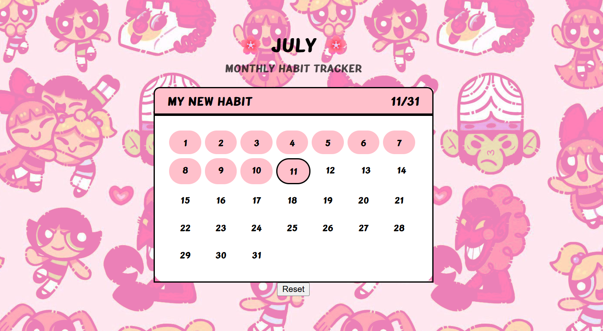

# 🌸 Monthly Habit Tracker

A **simple, colorful, and interactive Habit Tracker** built with pure **HTML, CSS, and JavaScript**. It helps you stay accountable by tracking daily progress on a habit throughout the current month, using localStorage for data persistence.

---

## 📌 Features

- ✅ Set your own habit title
- 🗓️ Automatically adjusts to the current month and number of days
- 🟣 Click on a day to mark it as "done" (turns pink!)
- 🔢 Tracks total days completed out of the current month
- 💾 Data is stored in localStorage (so your progress stays even after refreshing)
- 🔁 Reset button to clear all progress for the month
- 🎀 Aesthetic and engaging user interface

---

## 💡 How It Works

1. On page load, it fetches the current month and displays a calendar.
2. You can click on the habit title to set your goal (e.g., “Read for 30 mins”).
3. Click on each day to toggle completion.
4. Completion status is saved in `localStorage` using unique date strings.
5. Reset button allows you to start fresh anytime.

---

## 🧪 Tech Stack

- **HTML5** – Page structure
- **CSS3** – Styling (custom fonts, background, calendar layout)
- **JavaScript (ES6)** – Logic, localStorage, dynamic calendar generation

---

## 🚀 Getting Started Locally

### Prerequisites

- Any modern web browser (Chrome, Firefox, Edge)
- No frameworks or dependencies required

### Steps

1. **Clone the repository:**

```bash
git clone https://github.com/PriyanshiGoyal501/Habit-Tracker.git
```
2. **Navigate to the project directory:**

```bash
cd Habit-Tracker
```
3. **Open the project in your browser:**

- Open `index.html` directly by double-clicking the file  
**OR**  
- Use **VS Code** with the Live Server extension:

```bash
code .
```
## 📷 Screenshot



## 👩‍💻 Author

**Priyanshi Goyal**  
📫 [GitHub Profile](https://github.com/PriyanshiGoyal501)  
🎨 Passionate about creating fun and useful web projects!


